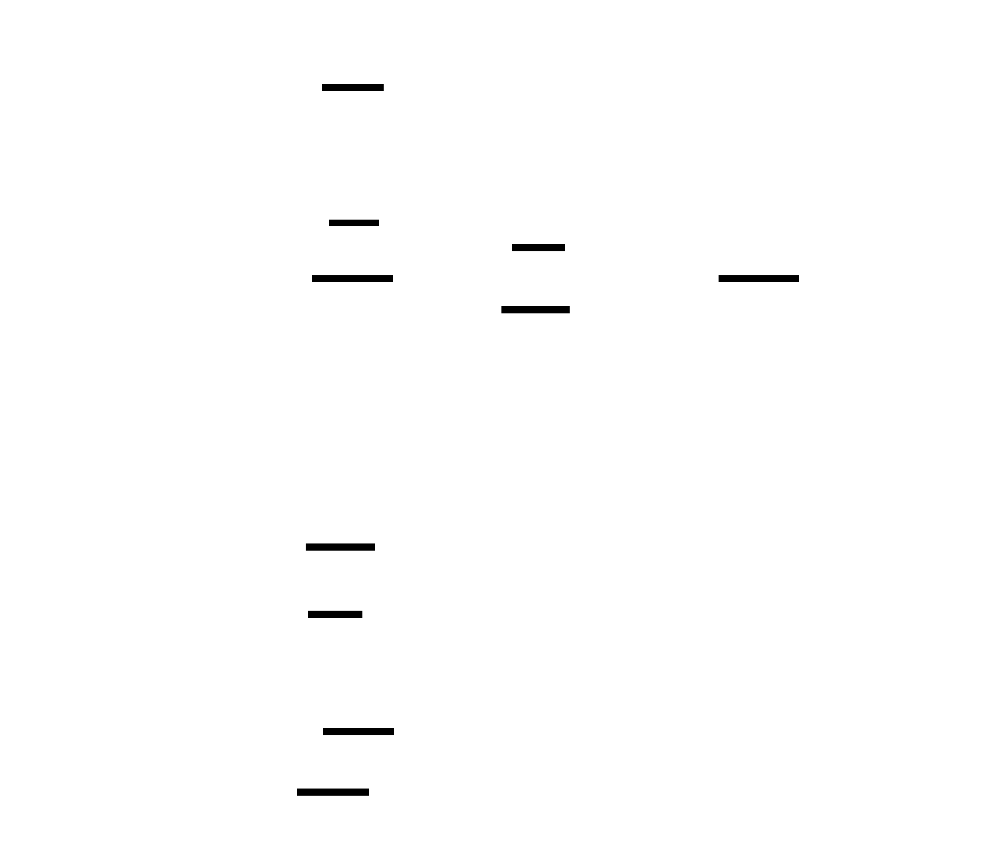

# Transporter

Transporter is a Kubernetes-native solution for live pod migration. It allows you to move running pods between nodes in a cluster with minimal downtime by leveraging checkpoint/restore technologies like CRIU.

## Overview

The project implements a standard Kubernetes operator pattern to orchestrate the complex process of capturing a pod's state on a source node and restoring it on a target node.

### Key Features

- **Live Migration:** Move running containers between nodes while preserving state.
- **Kubernetes Native:** Built using Custom Resource Definitions (CRDs) and the operator pattern.
- **Simple CLI:** User-friendly command-line interface for managing migrations.
- **Extensible Architecture:** Decoupled controller and node-level agents.

## Architecture



Transporter consists of three main components:

1.  **Transporter CLI (`transporter`):** A command-line interface for users to initiate and manage pod migrations.
2.  **PodMigration Controller (`controller`):** The control plane component that orchestrates the migration process and manages the `PodMigration` lifecycle.
3.  **Migration Agent (`migration-agent`):** A daemon running on each node (deployed as a DaemonSet) that executes the low-level migration tasks via gRPC.

## Components

### Transporter CLI

The CLI provides a simple interface to interact with the `PodMigration` CRDs.

**Commands:**

- `transporter migrate <pod-name> -n <namespace> -t <target-node>`: Starts a pod migration.
- `transporter status <migration-id>`: Checks the status of a specific migration.
- `transporter list`: Lists all migrations in progress.

### PodMigration Controller

The controller watches for `PodMigration` resources and moves them through various phases:

- **Pending:** Initial setup and node discovery.
- **Syncing:** Preparing the target node (e.g., pre-pulling images).
- **Finalizing:** Triggering the actual migration on the source node.
- **Completed/Failed:** Final state and cleanup.

### Migration Agent

The agent runs on every node as a gRPC server. It interfaces with the container runtime (containerd) and CRIU to:
- Checkpoint running containers.
- Transfer state to target nodes.
- Restore containers from checkpoints.

## Workflow

1.  User initiates migration via `transporter migrate`.
2.  CLI creates a `PodMigration` Custom Resource.
3.  The Controller detects the new resource and identifies source/target node IPs.
4.  The Controller calls the **Target Agent** to prepare the environment (pull images, etc.).
5.  The Controller calls the **Source Agent** to checkpoint the pod and transfer state.
6.  The Controller updates the CR status throughout the process.
7.  Upon completion, the controller performs cleanup.

## Getting Started

### Building

You can build all components using the provided Makefile:

```bash
make build
```

This will generate the `transporter` CLI binary in the root directory.

### Deployment

The controller and agents can be deployed using the Helm chart provided in `helm-chart/`.

```bash
helm install transporter ./helm-chart
```

## Project Structure

- `api/`: Custom Resource Definition (CRD) types.
- `cmd/transporter/`: CLI source code.
- `controller/`: Kubernetes controller logic.
- `migration-agent/`: Node-level agent logic.
- `helm-chart/`: Kubernetes deployment manifests.
- `pkg/agent/api/`: gRPC service definitions for agent communication.
